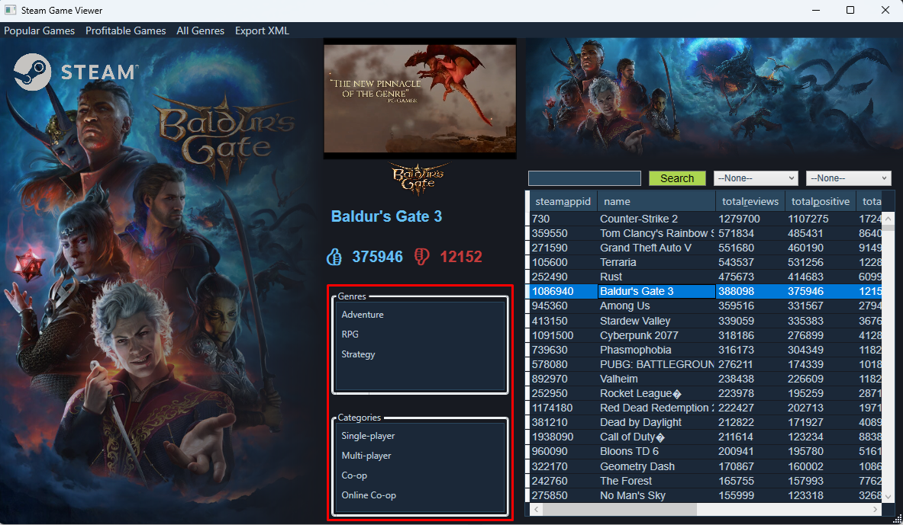

# ADO.NET-disconnected-3---SteamSpringSale

## Inleiding - Steam marktstudie
De Steam Spring Sale is ten einde gelopen. Met de sale is er een dataset gepubliceerd met alle info van alle games die op dat moment op Steam geïnventariseerd stonden. Tracht een onderzoek te doen op deze dataset, **zodat je te weten komt welke soort games het meest interessant zijn om te ontwikkelen**.

Je gaat aan de slag met het implementeren van methodes in de SteamGamesData class library. Deze klasse beheert een verzameling Steam-games en gerelateerde gegevens met behulp van ADO.NET's disconnected.

De uitdaging van deze opdracht focust op het verwerken van één bestand waarin twee meer op meer relaties zitten.

## 1. Games DataSet aanmaken

### Aanmaken van DataTables
In de statische constructor van SteamGamesData worden de vijf verschillende DataTables aangemaakt via hun respectievelijke methode:
	
```
// Maak de DataTables
_gamesTable = CreateGamesDataTable();
_categoriesTable = CreateCategoriesDataTable();
_genresTable = CreateGenresDataTable();
_gameCategoriesTable = CreateGameCategoriesDataTable();
_gameGenresTable = CreateGameGenresDataTable();
```

Vul de inhoud van deze methodes aan en bouw de structuur na die je kan terugvinden in de onderstaande afbeelding:


De games tabel is gelinkt in een meer op meer relatie naar zowel de categories tabel als de genres tabel. De games tabel heeft gelijkaarige kolommen als het csv-bestand dat je kan terugvinden in deze opgave. De games tabel heeft echter een subset van de kolommen van het csv-bestand: je moet dus niet elke kolom uit het bestand toevoegen aan de DataTable.

Zorg ervoor dat je de juiste datatypes gebruikt bij het parsen van de kolommen.

 * Maak de DataTable aan voor _gamesTable in `CreateGamesDataTable()` en voorzie de kolommen: steamAppId, name, totalReviews, totalPositive, totalNegative, reviewScore, isReleased, releaseDate, isFree, priceInitial.
 * Maak de DataTable aan voor _categoriesTable in `CreateCategoriesDataTable()` en voorzie de kolom: name.
 * Maak de DataTable aan voor _genresDataTable in `CreateGenresDataTable()` en voorzie ook hier één kolom: name.
 * Maak de linking DataTable aan tussen _gamesTable en _catetoriesTable, genaamd _gamesCategoriesTable, in `CreateGameCategoriesDataTable()` en voorzie de kolommen: steamAppId en name.
 * Maak de linking DataTable aan tussen _gamesTable en _categoriesTable, genaamd _gamesGenresTable, in `CreateGameGenresDataTable()` en voorzie de kolommen: steamAppId en name.

### Aanmaken van DataSet

Initialiseer de _steamDataSet en voeg vervolgens alle DataTables toe aan de DataSet die je net hebt aangemaakt in de statische constructor van SteamGamesData.

## 2. Importeren van Gegevens vanuit CSV

Implementeer de methode:
```
public static void ReadCsvAndPopulateDataTables(string fileName)
```
### _gamesTable
Lees het CSV-bestand en vul de verschillende DataTable objecten met relevante gegevens.

Zorg ervoor dat je de juiste datatypes gebruikt bij het parsen van de kolommen.
Het csv-bestand heeft de volgende inhoud:

|steam_appid|name|developers|publishers|categories|genres|required_age|n_achievements|platforms|is_released|release_date|additional_content|total_reviews|total_positive|total_negative|review_score|review_score_desc|positive_percentual|metacritic|is_free|price_initial (USD)|
|-----------|----|----------|----------|----------|------|------------|--------------|---------|-----------|------------|------------------|-------------|--------------|--------------|------------|-----------------|-------------------|----------|-------|-------------------|
|730        |Counter-Strike 2|['Valve'] |['Valve'] |['Multi-player', 'Cross-Platform Multiplayer' ...]|['Action', 'Free To Play']|0           |1             |['windows', 'linux']|WAAR       |21/08/2012 0:00|[]                |1279700      |1107275       |172425        |80          |Very Positive    |865                |0         |WAAR   |0                  |
|489830     |The Elder Scrolls V: Skyrim Special Edition|['Bethesda Game Studios']|['Bethesda Softworks']|['Single-player', 'Steam Achievements', ...]|['RPG']|74          |75            |['windows']|WAAR       |27/10/2016 0:00|['The Elder Scrolls V: Skyrim Special Edition - Creations']|109103       |103103        |6000          |80          |Very Positive    |945                |74        |ONWAAR |3999               |

Niet alle kolommen bevatten data die klaar is om opgeslaan te worden in een DataTable. Je zal de volgende aanpassingen moeten maken:
 * Indien de naam van een game bestaat uit een hoeveelheid van vraagtekens, dan wordt deze waarde aangepast naar "unknown". Bv: "??????" wordt "unknown".
 * De isReleased en isFree kolommen moeten een boolean bevatten. In plaats van WAAR of ONWAAR, sla je de waarde `true` of `false` op.
 * De releaseDate kolom bevat datums, maar ook stukken tekst, "Not Released". 
	* Indien de waarde "Not Released" in een rij staat, sla dan de `DBNull.Value` op in de releaseDate kolom.
	* Anders, sla je het geconverteerde DateTime object op. *(Tip: gebruik DateTime.ParseExact) (Tip2: let op, soms bevat deze waarde ook een uur. Je moet dit uur niet mee opslaan.)*
 * De priceInitial kolom bevat de prijs in cents.

### _categoriesTable en _gameCategoriesTable

Wanneer je door de bovenstaande rijen neust van Counter-Strike 2 en The Elder Scrolls V: Skyrim Special Edidtion, dan zal je merken dat de rijen voor de categories kolom meerdere waardes heeft. In plaats van alle waardes van deze meer op meer relatie telkens in één rij te proppen, zal je een linking tabel maken tussen games en categories.
 * Voorzie eerst een manier om deze waarde, zoals: ['Multi-player', 'Cross-Platform Multiplayer' ...] op te splitsen naar een string array.

Vervolgens kan je inhoud voor de categories kolom doorgeven aan de methode `AddCategoryRelationForSteamAppId(string[] categories, int steamAppId)`. Implementeer de AddCategoryReleationForSteamAppId() methode.
 * Overloop elke categorie in de string array.
 * Je zal een manier moeten hebben om te controleren of een gegeven categorie al bestaat in de _categoriesTable. Aangezien we willen vermijden dat we één categorie meerdere keren zouden toevoegen in dezelfde tabel. Implementeer hiervoor de methode: `bool IsValueInTable(DataTable dt, string columnName, string value)`. Deze methode valideert of een gegeven waarde voor een gegeven kolomnaam reeds aanwezig is in een gegeven tabel.
 * Gebruik IsValueInTable om te controleren of de categorie al bestaat in _categoriesTable. Zoniet, voeg dan een nieuwe rij toe.
 * Voeg voor elke categorie van het spel een rij toe in de linking tabel: _gameCategoriesTable.


### _genresTable en _gameGenresTable
Herhaal hetzelfde  patroon voor genres als voor categorieën:
 * Voorzie een manier om de genres in de csv te converteren naar een string array: verwijder de vierkante haakjes en splits de tekst op per genre.
 * Controleer of een genre reeds aanwezig is in de _genresTable met behulp van de `IsValueInTable` methode en voeg enkel het genre toe als het nieuw is.
 * Voeg de link tussen _games en _genres toe in de linking tabel _gameGenresTable.

## 3. Genres en Categorieën ophalen
In de applicatie worden genres en categorieën opgehaald om een overzicht te bieden van alle genres en om te functioneren als filters op de data.


Implementeer de	methode GetAllGenres() en GetAllCategories() die beide een List van string's teruggeven van alle genres en categorieën.

```
public static List<string> GetAllGenres()
```
 * Overloop alle rijen van de _genresTable tabel en voeg de namen van de genres toe aan de List die je teruggeeft in `GetAllGenres()`.
 * Herhaal hetzelfde patroon voor `GetAllCategories()`. 

## 4. Genres en Categorieën zoeken op steamAppId

De twee ListBoxen links van het DataGrid worden gevuld met de genres en categorieën die gelinkt zijn met het geselecteerde spel in het DataGrid. Hiervoor moet je in SteamGamesData twee methodes voorzien:
```
public static List<string?> GetAllGenresBySteamAppId(int steamAppId)
```
en
```
public static List<string?> GetAllCategoriesBySteamAppId(int steamAppId)
```
Doorzoek de linking table naar het gegeven steamAppId om te vinden welk(e) genre/categorie gelinkt is aan het gegeven steamAppId.



## 5. Filteren op naam
Implementeer de methdode SearchGameTable():
```
public static DataTable SearchGamesTable(string searchTerm, DataTable dataTableToFilter)
```
Om in deze methode te filteren op naam doe je het volgende:
 * De DataTable die wordt meegegeven aan de methode moet gefilterd worden.
 * Je neemt een clone van de _gamesTable. (De `Clone()` methode van DataTable neemt een kopie van de structuur van de DataTable, maar niet van de inhoud/rijen (zoals `Copy()`)).
 * Je overloopt elke rij van de oorspronkelijke DataTable, _gamesTable.
 * Je controleert of de gegeven rij de zoekterm bevat in de naam van het spel. *(Let op: je controle is niet hoofdletter gevoelig.)*
 * Voeg de rij toe van _gamesTable naar je geclonede DataTable. *(Tip: je kan hiervoor de ImportRow() methode van DataTable gebruiken.)*


## 6. Winst in kaart brengen

Om in kaart te brengen welke games hoeveel opgebracht hebben van hun verkopen op hun reviews maak je een nieuw overzicht voor het "Profitable Games" menu-item.

Implementeer de methode:
```
public static DataTable GetAllGameProfits()
```
Om in deze methode de DataTable te maken waarin de winst van de games in wordt getoond doe je het volgende:
 * Neem een kopie van de _gamesTable met de `Copy()` methode van DataTable.
 * Voeg een kolom toe aan je gekopieerde DataTable, genaamd "profits".
 * Bereken voor elke game in de DataTable wat de waarde van de nieuwe "profits" kolom is = `total_reviews * initial_price / 100`.
 * Verwijder tot slot de volgende kolommen: total_review, total_positive, total_negative, review_score, is_released, release_date en is_free.


## 7. Populaire spellen

Gelijkaardig aan de "profits" uit 6. ga je nu een overzicht maken met een populariteitsscore die je toevoegt aan ieder spel in de methode `GetAllPopularGames()`.

Implementeer de methode:
```
public static DataTable GetAllPopularGames()
```
 - Neem een kopie van de _gamesTable met de `Copy()` methode van DataTable.
 - Voeg een kolom toe aan je gekopieerde DataTable, genaamd "popularity_score".
 - Bereken voor elke game in de DataTalbe wat de waarde van "popularity_score" is = `total_positive / total_reviews`.
 - Filter alle rijen uit de DataTable die minder dan 5000 positieve reviews hebben.
 - Filter alle rijen uit de DataTable die een populariteitsscore hebben die lager is dan 0.9.
 - Verwijder tot slot de volgende kolommen: is_released, release_date, price_initial en is_free.


## 8. Exporteren naar een DataSet

Implementeer de methode:
```
public static void ExportXML(string fileName)
```

Zorg er voor dat ExportXML de _steamDataSet exporteert naar een XML bestand naar het gegeven path.

## 9. Extra

### Multiple Windows
Fris je kennis op van Multiple Windows. Zorg er voor dat wanneer je een spel selecteert in het PopularGamesWindow of ProfitableGamesWindow dat hetzelfde spel ook geselecteerd wordt in het DataGrid van MainWindow.

Verder kan je deze lijn doortrekken door de ListBox van AllGenresWindow en welk ComboBoxItem geselecteerd is in de genresComboBox van MainWindow.

### Data manipulatie
Tot slot kan je als onderzoeker aan het werk gaan en nieuwe MenuItems toevoegen die meer vragen proberen te beantwoorden uit deze dataset:
 - Hoeveel games bestaan er in ieder genre?
 - Wat is de gemiddelde hoeveelheid positieve reviews per genre?
 - Wat is de gemiddelde prijs van een game per genre?
 - Zijn gratis games populairder dan betaalde games?
 - Hoeveel games zijn er per jaar uitgebracht?
 - ...

Veel success!
